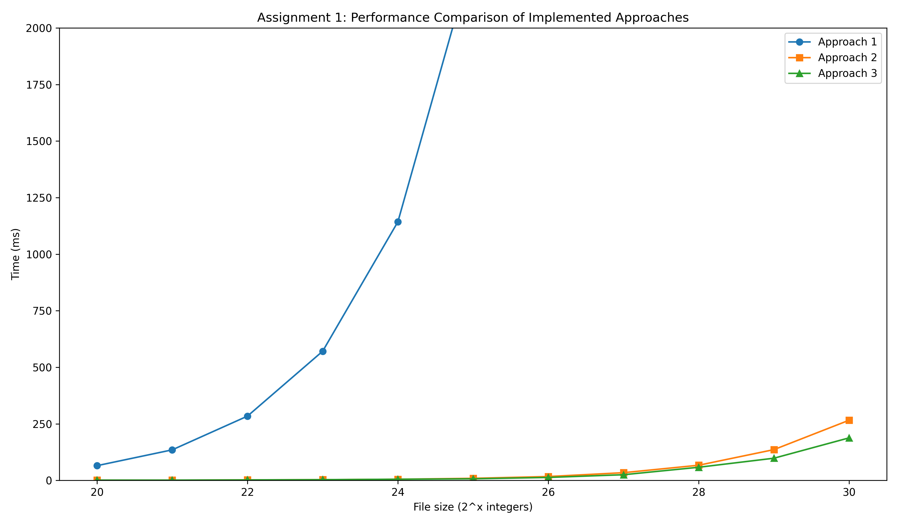
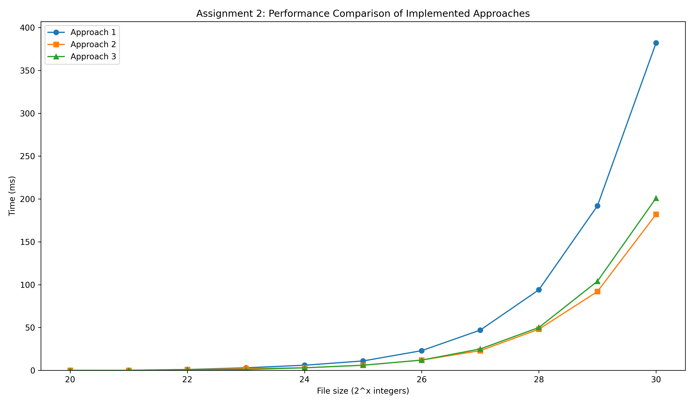

# Interview Assignment to RoboAuto
Some of the sub-assignments are solved using several approaches, usually from naive to advanced. See the `#ifdef` preprocessor directives in the `assignment.cpp` file.

## Compilation
A `Makefile` was created to conveniently compile the sub-assignments with specific implemented approach. Commands `make a1`, `make a2` and `make a3` can be used to compile for the first, second and third approach respectively.

Some of the approaches require quite recent Intel CPUs. The preferred compiler is therefore from Intel as well. Be aware, that some `make` commands may not work on your system.

## Tests
All of the sub-assignments were tested for correctness. The tests can be replicated with the following commands: `python utils/file_gen.py; python tests/test.py`.

## Performance Analysis
Performance was analyzed on implementation of the first and second sub-assignments. The results can be replicated with the following command: `python tests/performance.py`.

### Performance Analysis Plots

